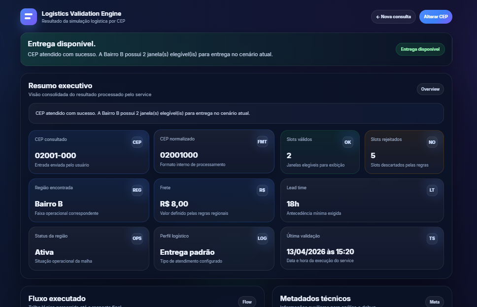
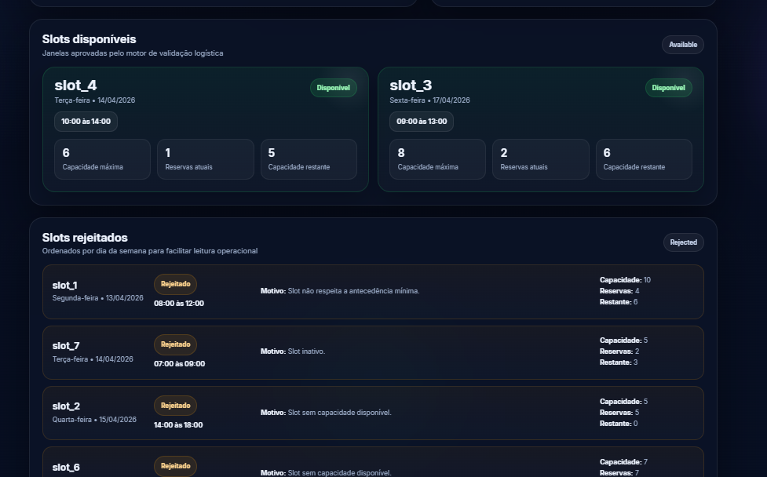

# Logistics Validation Engine

## Overview

Logistics Validation Engine is a simulation of a delivery eligibility system based on ZIP code rules.
The project demonstrates how operational logistics rules can be transformed into a structured, auditable decision flow and presented through a clear and professional interface.

The system processes a ZIP code input and determines delivery availability based on region mapping, operational constraints, lead time and slot capacity.

---

## Portuguese Version

### Contexto

Este projeto simula um motor de validação logística semelhante ao utilizado em operações reais de e-commerce com entrega agendada.

A aplicação recebe um CEP e executa uma sequência de validações para determinar se a entrega é possível e quais janelas estão disponíveis.

---

### Funcionalidades

* Normalização e validação de CEP
* Mapeamento de regiões por faixa de CEP
* Regras de bloqueio por CEP e por região
* Aplicação de regras operacionais por região
* Validação de lead time mínimo
* Controle de capacidade por slot
* Separação entre slots disponíveis e rejeitados
* Exibição de motivos de rejeição
* Resumo executivo da decisão
* Fluxo técnico da execução
* Payload JSON para inspeção e debug

---

### Fluxo da lógica

1. Receber CEP do usuário
2. Normalizar e validar formato
3. Identificar região correspondente
4. Verificar bloqueios operacionais
5. Aplicar regras da região
6. Avaliar slots de entrega
7. Separar slots válidos e inválidos
8. Retornar resultado estruturado

---

### Interface

#### Tela inicial

#### Resultado da validação

#### Slots disponíveis e rejeitados

---

### Cenários de teste

02001-000 → entrega disponível
01005-000 → CEP bloqueado
03001-000 → região bloqueada
99999-999 → fora da malha

---

## English Version

### Context

This project simulates a logistics validation engine similar to those used in real-world e-commerce delivery operations.

The application receives a ZIP code and executes a validation pipeline to determine delivery availability and eligible delivery slots.

---

### Features

* ZIP code normalization and validation
* Region mapping by ZIP code range
* Blocking rules (ZIP and region level)
* Region-based operational constraints
* Lead time validation
* Slot capacity control
* Separation between available and rejected slots
* Rejection reason tracking
* Executive summary of the decision
* Execution flow visualization
* JSON payload for debugging and integration

---

### Logic flow

1. Receive ZIP code
2. Normalize input
3. Identify region
4. Validate restrictions
5. Apply operational rules
6. Evaluate delivery slots
7. Separate valid and invalid slots
8. Return structured response

---

## Project Structure

.
├── index.php
├── resultado.php
├── service.php
└── screenshots/

---

## How to Run

1. Place the project inside your local server directory
2. Start Apache (XAMPP or similar)
3. Access in browser:

http://localhost/seu-projeto/index.php

---

## Technical Notes

The project uses a mock-based service layer to simulate real logistics scenarios without relying on external APIs or databases.

The response structure was designed to be reusable in a future API implementation, containing both business data and technical metadata.

The interface was intentionally built to translate backend decision logic into a clear and structured user experience.

---

## Why This Project Matters

This project demonstrates:

* ability to model real business rules
* transformation of logic into structured output
* separation between processing and presentation
* focus on clarity and auditability
* concern with user experience and readability

It goes beyond a simple interface by representing how a real logistics validation system behaves internally.

---

## Author

Luis Otavio Santini Feitosa
